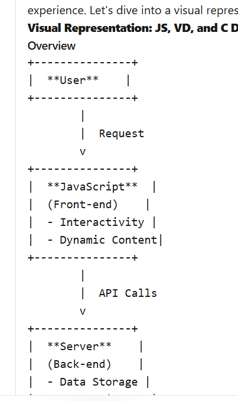

 # MindCoach - AI Copilot Instructions

## Project Overview

MindCoach ("Expand Your Mind. Grow Ahead.") is a React-based learning platform built with Vite, TypeScript, and shadcn/ui. The app provides three core learning experiences:

1. **Ask MindCoach** (Default - AI chat with full history management)
2. **Projects** (Structured learning journeys with AI-generated sub-chats)
3. **Discover** (Industry trends, news, tips, and tools)

**Architecture Pattern**: ChatGPT-style sidebar with collapsible sections for chat history and project management. Each project contains nested AI-generated sub-chats that are contextual and conversational.

**Tech Stack**: Vite + React + TypeScript + shadcn/ui + Tailwind CSS + React Router + TanStack Query

## Architecture Patterns

### Component Organization

- **UI Components** (`src/components/ui/`): Radix UI primitives wrapped with shadcn/ui styling. Never modify these directly - regenerate via `npx shadcn@latest add <component>`.
- **Application Components** (`src/components/`): App-specific components like `Layout`, `AppSidebar`, `NavLink`.
- **Pages** (`src/pages/`): Route-level components rendered by React Router:
  - `AskMindCoach` - **Default landing page** (/) - Main chat interface with history management
  - `Projects` - Project list and nested sub-chat management
  - `ProjectDetail` - Individual project view with AI-generated sub-chats
  - `ChatDetail` - Individual sub-chat conversation within a project
  - `Discover` - Industry trends, news, and tips feed
  - `Settings` - User preferences and account settings
  - `NotFound` - 404 page
  - ~`Home`~ - Removed (chat is now the default landing page)

### Routing Structure

The app uses React Router v6 with a single `Layout` wrapper. Routes defined in `App.tsx`:
- All routes share the same sidebar layout via `<Layout>` component
- Navigation handled through custom `NavLink` component (wrapper around react-router-dom's NavLink)
- The `NavLink` component uses a custom `activeClassName` prop pattern instead of function-based className

**Route Map:**
```tsx
/ → Ask MindCoach (Default landing - chat interface)
/chat/:chatId → Individual chat conversation
/projects → Project list view
/projects/:projectId → Individual project with AI-generated sub-chats
/projects/:projectId/:chatId → Specific sub-chat conversation
/discover → Industry feed
/settings → User settings
```

**Sidebar Structure (ChatGPT-style):**
- **Chats** section: Collapsible history of all conversations
- **Projects** section: Collapsible list of projects, each containing nested sub-chats
- **Main Navigation**: Projects, Discover, Settings (chat is default, no separate nav item needed)

**Example NavLink usage**:
```tsx
<NavLink
  to="/projects"
  className="base-styles"
  activeClassName="active-specific-styles"
>
```

### Styling System

**HSL Color Variables**: All colors MUST be defined in HSL format in `src/index.css` using CSS custom properties:
- Design tokens: `--background`, `--foreground`, `--primary`, `--accent`, etc.
- Sidebar-specific tokens: `--sidebar-background`, `--sidebar-accent`, etc.
- Apply via Tailwind utilities: `bg-background`, `text-foreground`, `border-border`

**Utility Pattern**: Use `cn()` from `@/lib/utils` for conditional class merging:
```tsx
import { cn } from "@/lib/utils";
className={cn("base-classes", condition && "conditional-classes")}
```

### Path Aliases

Configured in `vite.config.ts`, `tsconfig.json`, and `components.json`:
- `@/` → `./src/` (e.g., `@/components/ui/button`, `@/lib/utils`)

## Development Workflow

### Commands
- **Dev Server**: `npm run dev` (runs on `http://[::]:8080`)
- **Build**: `npm run build` (production) or `npm run build:dev` (development mode)
- **Lint**: `npm run lint`
- **Preview**: `npm run preview`

### Adding shadcn/ui Components

Use the CLI instead of manual creation:
```bash
npx shadcn@latest add <component-name>
```

This auto-generates components with proper Radix UI integration in `src/components/ui/`.

### TypeScript Configuration

Relaxed type checking is enabled (see `tsconfig.json`):
- `noImplicitAny: false`
- `strictNullChecks: false`
- `noUnusedParameters: false`

This is intentional for rapid prototyping. Prefer explicit types when adding new features, but don't fight the existing patterns.

### ESLint Rules

- `@typescript-eslint/no-unused-vars`: OFF (intentionally disabled)
- React Hooks rules: ENFORCED via `eslint-plugin-react-hooks`
- React Fast Refresh: Warns on non-component exports in component files

## Key Integration Points

### State Management

- **TanStack Query**: Configured in `App.tsx` via `QueryClientProvider`. Use for async data fetching.
- **Local State**: React `useState` for component-level state (see `Explore.tsx` message handling).

### UI Feedback

Multiple toast/notification systems available:
- Shadcn Toast (`@/components/ui/toast`, `@/components/ui/toaster`)
- Sonner (`@/components/ui/sonner`)

Both are initialized in `App.tsx` and ready to use.

### Layout Structure

The `Layout` component (`src/components/Layout.tsx`) provides:
- Collapsible sidebar via shadcn's `SidebarProvider`
- ChatGPT-style sidebar with collapsible sections:
  - **Chats** (conversation history)
  - **Projects** (with nested sub-chats)
  - **Navigation** (Projects, Discover, Settings)
- Sticky header with `SidebarTrigger`
- Main content area with flex layout
- **Note**: Chat is the default landing page (/), not a separate navigation item

**Sidebar Patterns:**
- Use `Collapsible` component for expandable sections
- Each project in sidebar shows nested sub-chats (AI-generated)
- Chat history persists and can be resumed
- Active chat/project highlighted in sidebar
- New chat button (+) in sidebar header

All pages automatically inherit this structure when wrapped in `<Layout>`.

## Lovable Integration

This project is managed via [Lovable](https://lovable.dev) - an AI-powered development platform:
- Changes pushed to the repo sync automatically to Lovable
- Lovable commits are auto-pushed back to this repo
- The `lovable-tagger` plugin in `vite.config.ts` enables component tagging during development

## Project Conventions

### File Naming
- Components: PascalCase (e.g., `AppSidebar.tsx`, `NavLink.tsx`)
- Pages: PascalCase (e.g., `Home.tsx`, `Explore.tsx`)
- Utilities: camelCase (e.g., `utils.ts`)

### Import Order (observed pattern)
1. React imports
2. Third-party UI libraries (Radix, Lucide icons)
3. Application components/utilities (using `@/` alias)

### Icon Library
Use `lucide-react` for all icons (already included). Examples in `AppSidebar.tsx`: `Home`, `MessageSquare`, `Target`, `Compass`, `Settings`.

## Common Patterns

**Card-based Layouts**: Home page uses shadcn Card components with hover effects:
```tsx
<Card className="border-border hover:shadow-lg transition-shadow cursor-pointer">
```

**Responsive Design**: Use Tailwind's responsive prefixes (`md:`, `lg:`, etc.) with mobile-first approach.

**Container Pattern**: Pages use `container max-w-{size} mx-auto p-6` for consistent spacing.
